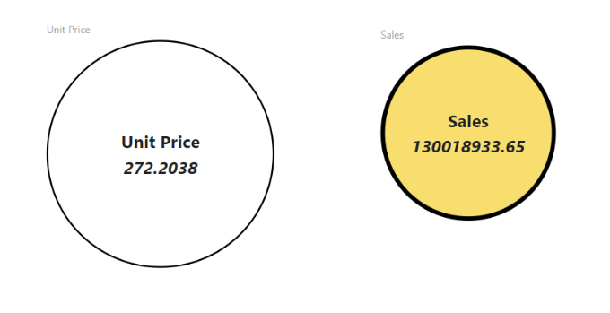

# Circle Card React Custom Visual

> Demo Custom Visual using React JS

# Overview

This repository represents a simple way to use React for development of Power BI Custom Visuals. Circle Card shows singular value inside a circle. It supports basic visual settings (color and circle thickness) and adaptability to viewport size.

React-based Custom Visual development basics are explained in [this tutorial](https://microsoft.github.io/PowerBI-visuals/tutorials/building-react-based-custom-visual/getting-started/). It describes step-by-step creation of Circle Card. You're welcome to use that example as a base to your own Custom Visuals by cloning this repository or using `pbiviz new react` command of [Power BI Visuals Tools](https://github.com/Microsoft/PowerBI-visuals-tools).

# Contributing

This project welcomes contributions and suggestions.  Most contributions require you to agree to a
Contributor License Agreement (CLA) declaring that you have the right to, and actually do, grant us
the rights to use your contribution. For details, visit https://cla.microsoft.com.

When you submit a pull request, a CLA-bot will automatically determine whether you need to provide
a CLA and decorate the PR appropriately (e.g., label, comment). Simply follow the instructions
provided by the bot. You will only need to do this once across all repos using our CLA.

This project has adopted the [Microsoft Open Source Code of Conduct](https://opensource.microsoft.com/codeofconduct/).
For more information see the [Code of Conduct FAQ](https://opensource.microsoft.com/codeofconduct/faq/) or
contact [opencode@microsoft.com](mailto:opencode@microsoft.com) with any additional questions or comments.
